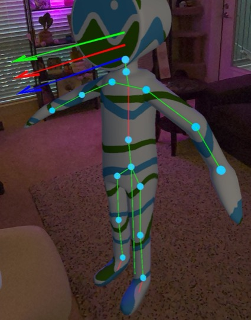

# Homebody

An AI-powered avatar for your space. Runs entirely on your own machine — bring
your own [OpenRouter](https://openrouter.ai/) API key.

<p align="center">
  <b>Demo video</b><br>
  <a href="https://www.youtube.com/watch?v=za02Rx1VJzc">
    
  </a>
</p>

<p align="center">
  <b>Eve, a fully rigged avatar</b><br>
  <a href="https://www.youtube.com/watch?v=wFHL_zmMQ7w">
    
  </a>
</p>

## You need

- [Docker Desktop](https://www.docker.com/products/docker-desktop/), running
- An [OpenRouter](https://openrouter.ai/) API key
- A Meta Quest 3 with the [Homebody APK](https://github.com/homebody-app/homebody-app/releases/latest)
  sideloaded, on the same Wi-Fi network

Ships with a default avatar (Cesium Man) — no download needed to get started.

## Setup

**Windows**: download and extract [this zip](https://github.com/homebody-app/homebody-app/archive/refs/heads/main.zip),
then double-click `run.bat` inside it — it creates `.env` from the template, asks for your
OpenRouter API key and name the first time (edit `.env` yourself later to change them), then
starts Docker and the announcer for you. Leave the window open, put on your headset.

If your headset says "no server detected," double-click `setup-firewall.bat` once (it'll ask for
admin permission) to open the ports Homebody needs, then try again. `remove-firewall.bat` undoes
those rules if you ever want them gone.

**macOS/Linux**:

1. Clone/download this repo, open a terminal here.
2. `cp .env.example .env`, fill in `OPENROUTER_API_KEY` and `PLAYER_NAME`. Set `TZ` to your
   [IANA timezone](https://en.wikipedia.org/wiki/List_of_tz_database_time_zones) (e.g.
   `America/Los_Angeles`) — without it the container defaults to UTC.
3. Start everything and put on your headset:
   ```
   docker compose up -d
   ./bin/homebody-server-mac        # macOS -- pick one for your OS, leave it running
   ./bin/homebody-server-linux      # Linux
   ```
   The binary broadcasts on your Wi-Fi so the headset can find the server — Docker
   can't do that by itself. Your headset finds it automatically once both are running.

## Stopping

`docker compose down` — your avatar's memory and state (`data/`, `mempalace/`)
persist between runs.

## Layout

| Folder | What's there |
|---|---|
| `resources/avatars/` | Avatar config JSON — ships with the default (Cesium Man); swap in your own via [AVATAR_SETUP.md](AVATAR_SETUP.md) |
| `resources/models/` | Only needed if your avatar's `model_url` points here instead of an external URL (the default doesn't) |
| `resources/animations/` | Idle/talking/sit poses (`.hbanim`) — included; record your own or grab more from Discord |
| `resources/effects/` | Sound files for `sense_score_fx`, if your avatar uses it |
| `resources/decision-engines/` | Auto-generated, leave alone |
| `resources/player.json` | Your own config, leave as-is unless you need it |
| `data/`, `mempalace/` | Server state and your avatar's memory |

## Rigging

The default avatar has no bones mapped yet, so movement/grabbing won't work until
you hold B to open the radial menu and select **Settings → Rigging Mode** once
connected, and map them yourself:



Want a different avatar entirely, or help mapping one? See
[AVATAR_SETUP.md](AVATAR_SETUP.md).

## Troubleshooting

- **Headset never finds the server** — is `bin/homebody-server-*` running? Same
  Wi-Fi (not a guest/isolated network)?
- **Model never loads** — GLB filename must match `model_url` in your avatar's JSON.
- **Container won't start** — `docker compose logs -f`

## Community

Questions, bugs, or want to share what your avatar said? Join the
[Discord](https://discord.gg/dPszJfW35m).

[Patreon](https://www.patreon.com/cw/codingandcoffee/membership) link if you want to support me.
